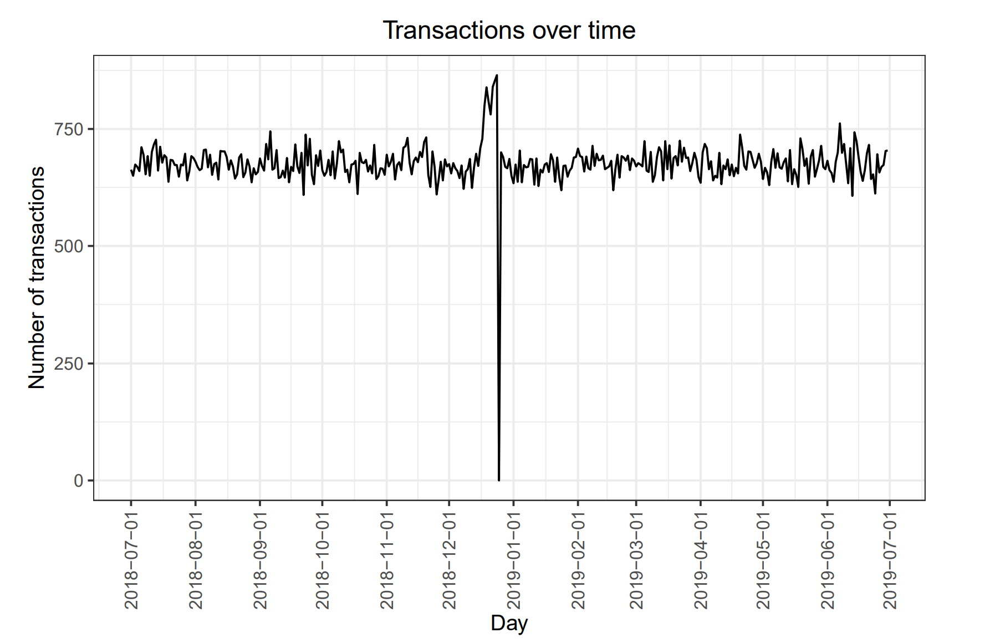
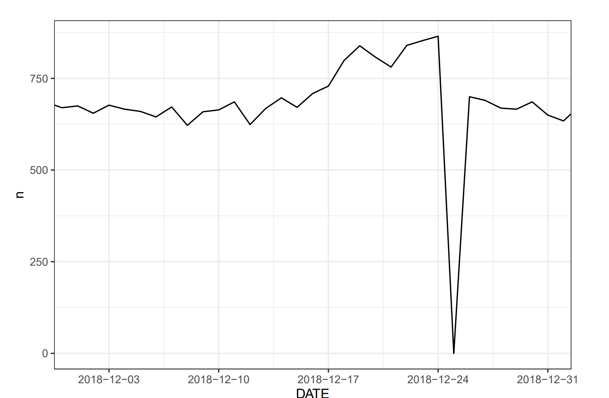
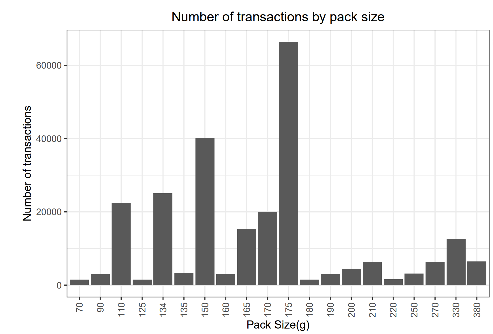
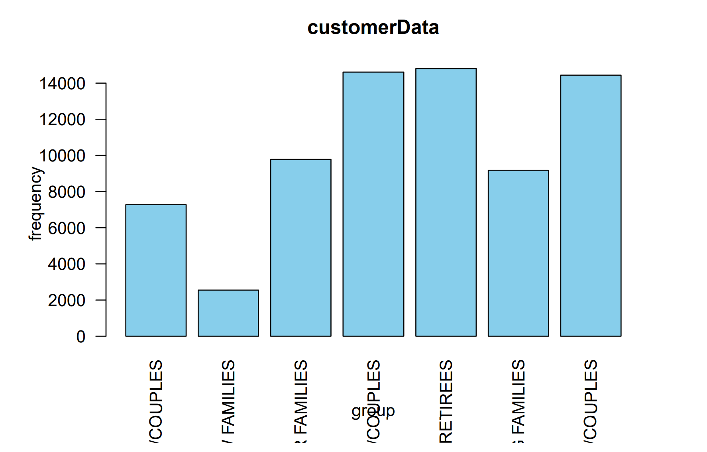
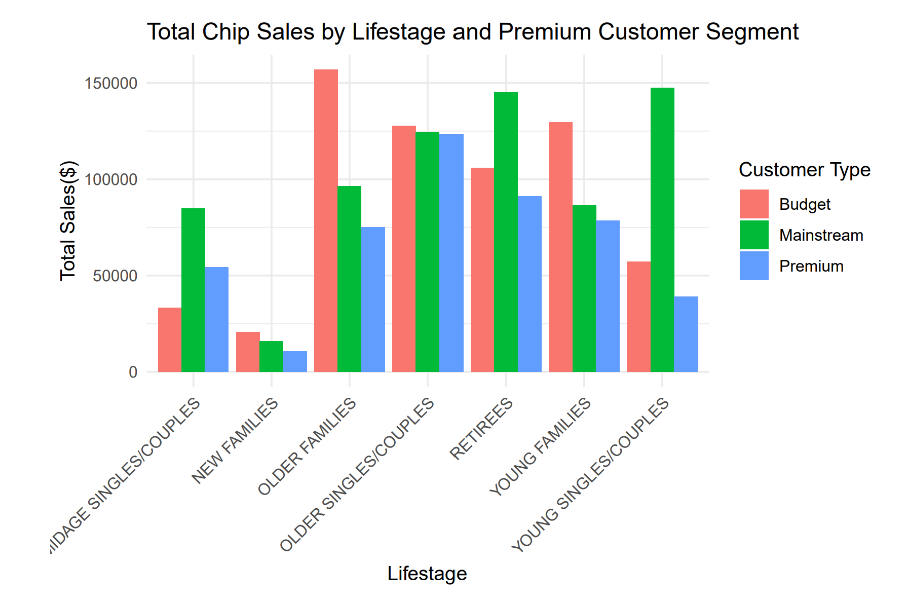
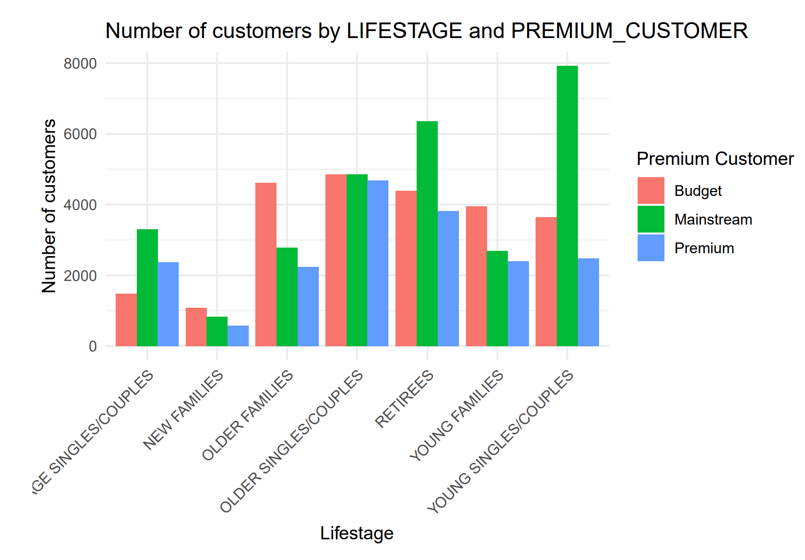
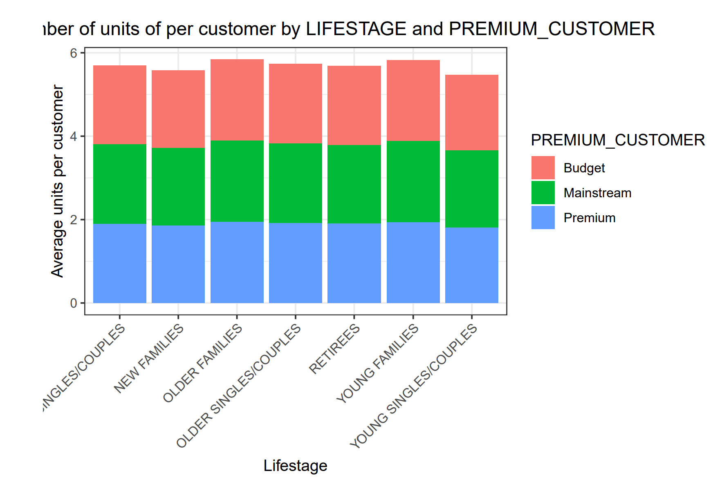
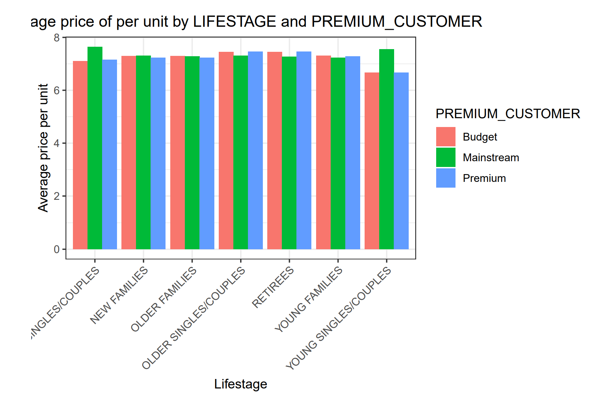

# Chips Sales Data Analysis
## Backround
You are part of Quantium’s retail analytics team and have been approached by your client, the Category Manager for chips, who wants to better understand the types of customers who purchase chips and their purchasing behaviour within the region.

The insights from your analysis will feed into the supermarket’s strategic plan for the chip category in the next half year.
## Tool Used
R:Data Cleaning, Analysis, and Visualization
## Data File
You can find the original file here:[QVI_purchase_behaviour](QVI_purchase_behaviour.csv),  [QVI_transaction_data](QVI_transaction_data.csv)
## Data Processing
### 1、Library Packages
To extend a programming language's capabilities we need to library packages first.
```
library(tidyverse)
library(data.table)
library(ggplot2)
library(readr)
library(dplyr)
```
### 2、Data Cleaning
Import a file.
```
filePath <- "F:/QVI/"
transactionData <- fread(paste0(filePath,"QVI_transaction_data.csv"))
customerData <- fread(paste0(filePath,"QVI_purchase_behaviour.csv"))
```
To learn about types of different columns
```
str(transactionData)
str(customerData)
```
I noticed that the DATE column was not displayed in the correct data type.

So next step is to revise it. 
```
transactionData$DATE <- as.Date(transactionData$DATE, origin = "1899-12-30")
```
And then should check the right products by examining PROD_NAME.
```
summary(as.factor(transactionData$PROD_NAME))
```
I need to check that these are all chips. So I can do some basic text analysis by summarising the individual words in the product name.
```
productwords <- data.table(unlist(strsplit(unique(transactionData[,PROD_NAME])," ")))
setnames(productwords,"words")
clean_words <- productwords[!grepl("[0-9&/]",words),]
word_freq <- clean_words[, .N, by = words][order(-N)]
head(word_freq)
```
There are different sales products in the dataset. But I only need chips category so I need to remove them.
```
transactionData[, SALSA := grepl("salsa", tolower(PROD_NAME))]
transactionData <- transactionData[SALSA == FALSE,][, SALSA := NULL]
```
Next, I can use summary() to check summary statistics such as mean, min and max values for each
feature to see if there are any obvious outliers in the data and if there are any nulls in any of the columns.
```
summary(transactionData)
```
Filter the dataset to find the outlier
```
transactionData[PROD_QTY == 200,]
filter(transactionData, LYLTY_CARD_NBR == 226000)
transactionData <- filter(transactionData, LYLTY_CARD_NBR != "226000")
summary(transactionData)
```
Check if there are any obivious data issues.
```
transaction_by_date <- table(transactionData$DATE)
head(transaction_by_date)
```
There are only 364 rows which indicates a missing date. Let's found it.
```
complete_data <- transactionData %>%
count(DATE) %>%
complete(DATE = seq(as.Date("2018-07-01"), as.Date("2019-06-30"), by = "day"), fill = list(n = 0))
theme_set(theme_bw())
theme_update(plot.title = element_text(hjust = 0.5))
ggplot(complete_data, aes(x = DATE, y = n)) +
geom_line() +
labs(x = "Day", y = "Number of transactions", title = "Transactions over time") +
scale_x_date(breaks = "1 month") +
theme(axis.text.x = element_text(angle = 90, vjust = 0.5))
```

Zoom in.
```
ggplot(complete_data, aes(x = DATE, y = n)) +
geom_line() +
coord_cartesian(xlim = as.Date(c("2018-12-01", "2018-12-31"))) +
scale_x_date(date_labels = "%Y-%m-%d")
```

I noticed the missing day is Christmas Day so the outlier just because day off.
Now that there is satisffed that the data no longer has outliers.
Moving on to create other features such as brand of chips or pack size from PROD_NAME. I will start with pack size.
```
transactionData_table <- as.data.table(transactionData)
transactionData_table[, PACK_SIZE := parse_number(PROD_NAME)]
transactionData_table[, .N, PACK_SIZE][order(PACK_SIZE)]
```
Let's plot a histogram of PACK_SIZE
```
ggplot(transactionData_table, aes(x = factor(PACK_SIZE))) +
geom_bar() +
labs(x = "Pack Size(g)", y = "Number of transactions", title = "Number of transactions by pack size") +
theme(axis.text.x = element_text(angle = 90, vjust = 0.5, hjust = 1))
```

Pack sizes created look reasonable and now to create brands. Using the ffrst word in PROD_NAME to
work out the brand name.
```
transactionData_table[, BRAND := word(PROD_NAME,1)]
transactionData_table[, .N, by = BRAND][order(-N)]
```
The brand names look like they are of the same brands - such as RED and RRD, which are both Red
Rock Deli chips. Let’s combine these together.
```
transactionData_table[BRAND == "Red", BRAND := "RRD"]
```
Examining customer data
```
str(customerData)
summary(customerData)
head(customerData)
table(customerData$PREMIUM_CUSTOMER)
```
Let’s start with calculating total sales by LIFESTAGE and PREMIUM_CUSTOMER and plotting the split by
these segments to describe which customer segment contribute most to chip sales.
```
customerData_lifestage_table <-table(customerData$LIFESTAGE)
barplot(customerData_lifestage_table,
main = "customerData",
xlab = "group",
ylab = "frequency",
col = "skyblue",
las = 2)
```

Let’s see if the higher sales are due to there being more customers who buy chips.
```
data <- merge(transactionData,customerData, all.x = TRUE)
sum(is.na(data)
fwrite(data,paste0(filePath, "QVI_data.csv"))
sale_summary <- data %>%
group_by(LIFESTAGE, PREMIUM_CUSTOMER) %>%
summarise(Total_sales = sum(TOT_SALES, na.rm = TRUE), .group = "drop")
ggplot(sale_summary, aes(x = LIFESTAGE, y = Total_sales, fill = PREMIUM_CUSTOMER)) +
geom_col(position = "dodge") +
labs(title = "Total Chip Sales by Lifestage and Premium Customer Segment",
x = "Lifestage",
y = "Total Sales($)",
fill = "Customer Type") +
theme_minimal() +
theme(axis.text.x = element_text(angle = 45, hjust = 1))
```

```
customer_summary <- data %>%
group_by(LIFESTAGE,PREMIUM_CUSTOMER) %>%
summarise(customer_count = n_distinct(LYLTY_CARD_NBR), .group = "drop")
ggplot(customer_summary, aes(x = LIFESTAGE, y = customer_count, fill = PREMIUM_CUSTOMER)) +
geom_col(position = "dodge") +
labs(title = "Number of customers by LIFESTAGE and PREMIUM_CUSTOMER",
x = "Lifestage",
y = "Number of customers",
fill = "Premium Customer") +
theme_minimal() +
theme(axis.text.x = element_text(angle = 45, hjust = 1))
```

Let’s also investigate the average price per unit chips bought for each customer segment as this is also a
driver of total sales.
```
avg_units <- data %>%
group_by(LIFESTAGE, PREMIUM_CUSTOMER) %>%
summarise(avg_units_per_customer = mean(PROD_QTY), .group = "drop")
ggplot(avg_units, aes(x = LIFESTAGE, y = avg_units_per_customer, fill = PREMIUM_CUSTOMER)) +
geom_col() +
labs(title = "Average number of units of per customer by LIFESTAGE and PREMIUM_CUSTOMER",
y = "Average units per customer",
14x = "Lifestage") +
theme(axis.text.x = element_text(angle = 45, hjust = 1))
```

```
avg_price <- data %>%
group_by(LIFESTAGE, PREMIUM_CUSTOMER) %>%
summarise(avg_price_per_unit = mean(TOT_SALES), .group = "drop")
ggplot(avg_price, aes(x = LIFESTAGE, y = avg_price_per_unit, fill = PREMIUM_CUSTOMER)) +
geom_col(position = "dodge") +
labs(title = "Average price of per unit by LIFESTAGE and PREMIUM_CUSTOMER",
y = "Average price per unit",
x = "Lifestage") +
theme(axis.text.x = element_text(angle = 45, hjust = 1))
```

```
groupA <- subset(avg_price, (PREMIUM_CUSTOMER == "Mainstream" & LIFESTAGE == "MIDAGE SINGLES/COUPLES") | (PREMIUM_CUSTOMER == "Mainstream" & LIFESTAGE == "YOUNG SINGLES/COUPLES"))
groupB <- subset(avg_price, (PREMIUM_CUSTOMER == "Budget" & LIFESTAGE == "MIDAGE SINGLES/COUPLES") | (PREMIUM_CUSTOMER == "Budget" & LIFESTAGE == "YOUNG SINGLES/COUPLES"))
groupC <- subset(avg_price, (PREMIUM_CUSTOMER == "Premium" & LIFESTAGE == "MIDAGE SINGLES/COUPLES") | (PREMIUM_CUSTOMER == "Premium" & LIFESTAGE == "YOUNG SINGLES/COUPLES"))
t.test(groupA$avg_price_per_unit, groupB$avg_price_per_unit)
t.test(groupA$avg_price_per_unit, groupC$avg_price_per_unit)
```
### 3、Conclusion
Let’s recap what we’ve found!
Sales have mainly been due to Budget - older families, Mainstream - young singles/couples, and Mainstream-retirees shoppers. 
We found that the high spend in chips for mainstream young singles/couples and retirees
 is due to there being more of them than other buyers. Mainstream, midage and young singles and
couples are also more likely to pay more per packet of chips. 
We’ve also found that Mainstream young singles and couples are 23% more likely to purchase Tyrrells chips
compared to the rest of the population. 


