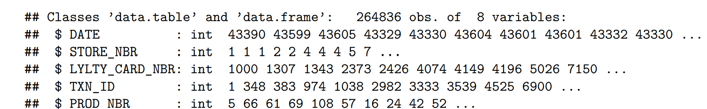

# Chips Sales Data Analysis
## Backround
You are part of Quantium’s retail analytics team and have been approached by your client, the Category Manager for chips, who wants to better understand the types of customers who purchase chips and their purchasing behaviour within the region.

The insights from your analysis will feed into the supermarket’s strategic plan for the chip category in the next half year.
## Tool Used
R:Data Cleaning, Analysis, and Visualization
## Data File
You can find the original file here:[QVI_purchase_behaviour](QVI_purchase_behaviour.csv),  [QVI_transaction_data](QVI_transaction_data.csv)
## Data Processing
### 1、Library Packages
To extend a programming language's capabilities we need to library packages first.
```
library(tidyverse)
library(data.table)
library(ggplot2)
library(readr)
library(dplyr)
```
### 2、Data Cleaning
Import a file.
```
filePath <- "F:/QVI/"
transactionData <- fread(paste0(filePath,"QVI_transaction_data.csv"))
customerData <- fread(paste0(filePath,"QVI_purchase_behaviour.csv"))
```
To learn about types of different columns
```
str(transactionData)
str(customerData)
```
I noticed that the DATE column was not displayed in the correct data type.

So next step is to revise it. 
```
transactionData$DATE <- as.Date(transactionData$DATE, origin = "1899-12-30")
```
